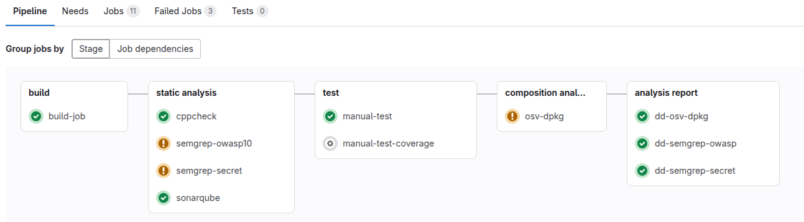

gitlab-ci.yaml - конвеер встраивался в проект C++ (  ). 
Состоит из:
- компонеты:
    + cppcheck 
    + semgrep secret
    + sonarqube
    + defectdojo
    + osv
- явно прописанные jobs:
    + buil
    + manual-test
    + coverage
    + fuzz
