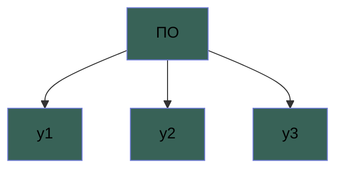
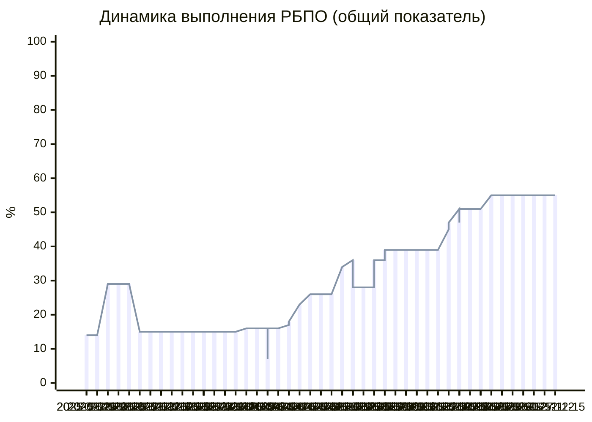

## Общая информация
Данные представлены в сильно сжатом виде.

## Выполнение
<table><thead><tr><th>Итого</th>
<th>y1</th>
<th>y2</th>
<th>y3</th>
</tr></thead><tr><tbody><td>..</td>
<td>81%</td>
<td>69%</td>
<td>22%</td>
</tr></tbody></table>

## Требования по безопасности

<table>
        <thead><tr>
        <th>Номер</th><th>Требование</th>
        <th>Количество</th></tr></thead>
        <tbody>
<tr><td>1</td><td>требование 1: описание</td><td>119</td></tr><tr><td>2</td><td>требование 2: описание</td><td>96</td></tr></tbody></table>

## у1

#### Объём кода по языкам
...

#### Статистика выполнения

<table><thead><tr><th>Подмодули</th><th>TOTAL 81%</th>
<th>SAST 97%</th><th>DAST 97%</th><th>xxx 97%</th><th>xxx 97%</th><th>xxx 0%</th><th>xxx 97%</th><th>xxx 100%</th><th>xxx DATA</th></tr></thead>
<tbody>
<tr><td>frontend</td><td>100</td><td>+</td><td>x</td><td>x</td><td>x</td><td>x</td><td>+</td><td>+</td><td>20хх-хх-хх хх:хх:хх</td></tr><tr><td>...</td><td>100</td><td>+</td><td>+</td><td>+</td><td>+</td><td>x</td><td>+</td><td>+</td><td>20xx-xx-xx xx:xx:xx</td></tr></tbody></table>

